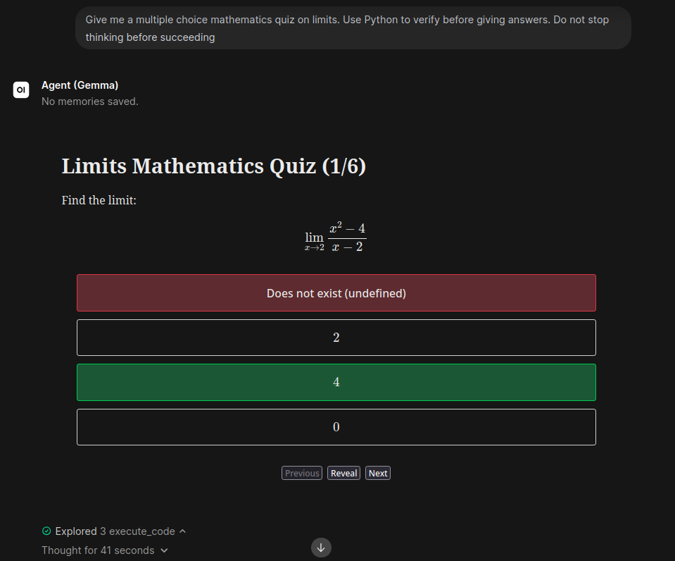
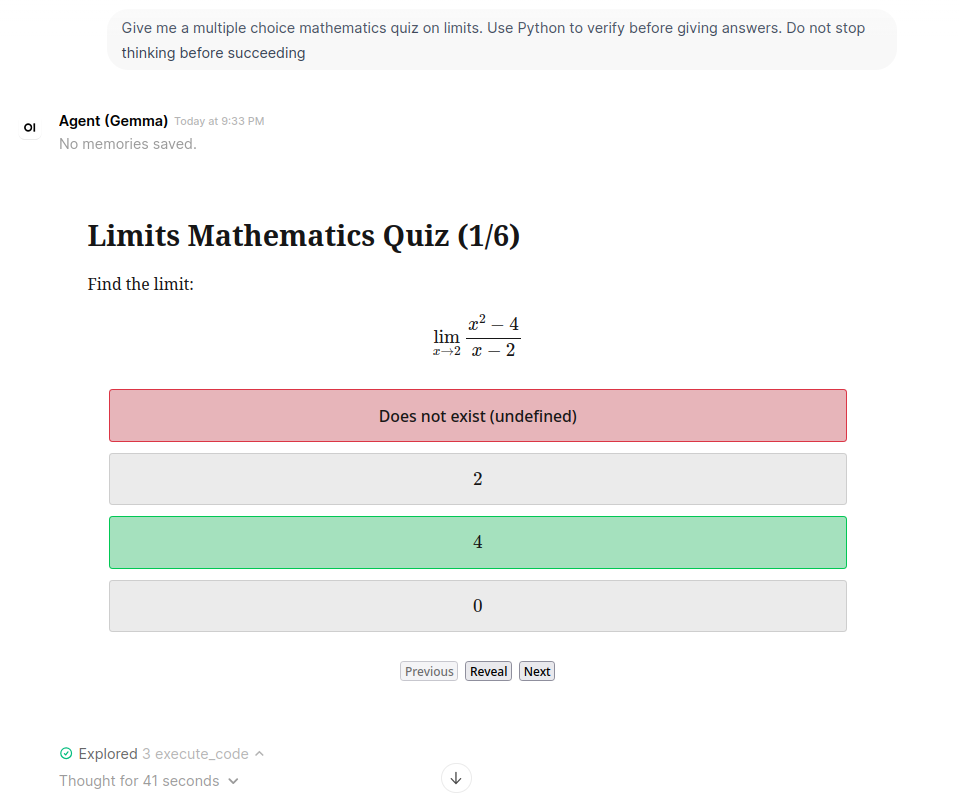

# QuizUI
This is a tool / action function for displaying multiple choice quizzes inside Open WebUI.
As Frontend and Backend are seperate, it can easily be adapted to work outside Open WebUI.

Features:
- Use any colorscheme you want, or make your own
- Render MathJax for LaTeX expressions (optional)
- Seperate Light/Dark themes
- Save a quiz and share it as an HTML file

## Example

Dark Mode

  

Light Mode

  

## Usage
There are two options:
- Put the tool code in Workspace > Tools > New Tool.
- Put the function code in Admin Panel > Functions > New Function.

> For the UI to render LaTeX with MathJax, you must turn it on in the settings (gear icon)

While the tool will work, I recommend using the action function since it is easier for an LLM to write quizzes naturally then by using a specific structure format via tool calling.

The function is triggered by pressing the action button under an LLM's message. 

If the function doesn't work for a particular format, most of the time it is because the LLM make an error somewhere (which it would have done with the tool either way). You can either manually fix it, or ask the LLM to convert it by itself using the tool. If it's not the case, please consider submiting a bug repport with the message's content so we can fix it.

## Recommendations

- Any model will work. However, some models such as Qwen3.5 9B can make formatting mistakes and doubt themselves, causing duplications on complicated quizzes. Gemma usually has better formatting.
- Currently, answer keys in a markdown table are not fully supported. Most standard formatting should work (adjust your prompt as needed).
- For parsing questions with the function, consider asking the LLM to begin all questions with "Question:", as the LLM can make more some mistakes otherwise.
- Supported languages by function tool: Parsing looks for French and English keywords (Question, Answer, A, Réponse, R) or a number. If you use another language, you can update the parsing in the code to add keywords or modify your prompt.
- For the function to work, BOTH the questions and the answers must be in the same message: if the LLM gives them in two different messages, you can edit the LLM's first message and paste the answer key there.
